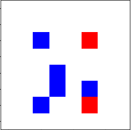
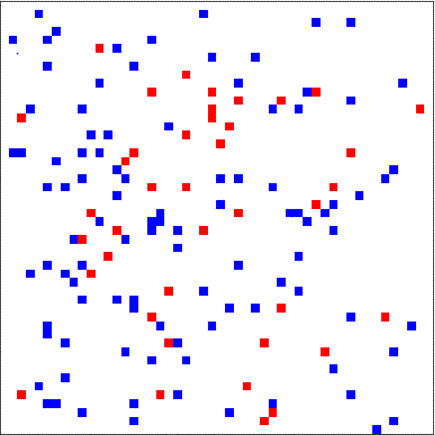

## Toy Multi agent environment

Start of a toy gym environment bank for multi-agent reinforcement learning.

This repo contains for the moment a first environment:

### Team catcher:

This is a map where targets are randomly placed.
    The objective of the agents is that there are at least two agents on an adjacent cell of a target to catch it.
    When the target is caught the environment returns a reward point.
    The episode ends when there is no more target on the map.




The number of agent and target can be arbitrarily large.





### How to use it ?

```python
import gym_ma_toy
import gym
env = env = gym.make('team_catcher-v0')
obs = env.reset()
done = False

while not done:
    obs, reward, done, info = env.step(env.action_space.sample())
    env.render()
```
